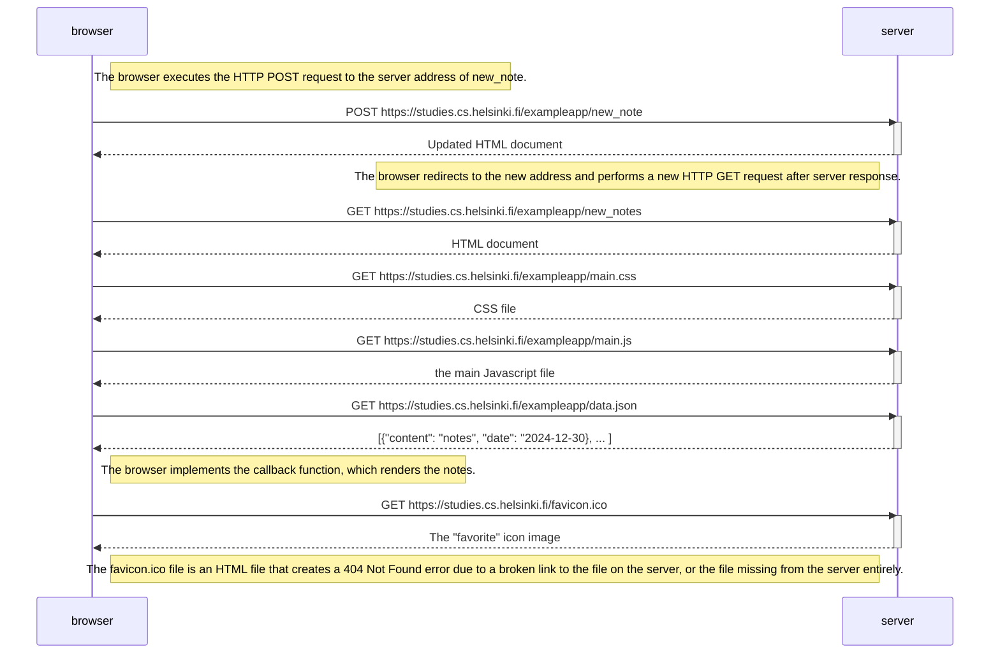

# Part 0, Exercise 0.4: New Note Diagram

```mermaid
sequenceDiagram
    participant browser
    participant server

    Note right of browser: The browser executes the HTTP POST request to the server address of new_note.

    browser->>server: POST https://studies.cs.helsinki.fi/exampleapp/new_note
    activate server
    server-->>browser: Updated HTML document
    deactivate server

    Note left of server: The browser redirects to the new address and performs a new HTTP GET request after server response.

    browser->>server: GET https://studies.cs.helsinki.fi/exampleapp/new_notes
    activate server
    server-->>browser: HTML document
    deactivate server

    browser->>server: GET https://studies.cs.helsinki.fi/exampleapp/main.css
    activate server
    server-->>browser: CSS file
    deactivate server

    browser->>server: GET https://studies.cs.helsinki.fi/exampleapp/main.js
    activate server
    server-->>browser: the main Javascript file
    deactivate server

    browser->>server: GET https://studies.cs.helsinki.fi/exampleapp/data.json
    activate server
    server-->>browser: [{"content": "notes", "date": "2024-12-30}, ... ]
    deactivate server

    Note right of browser: The browser implements the callback function, which renders the notes.

        browser->>server: GET https://studies.cs.helsinki.fi/favicon.ico
    activate server
    server-->>browser: The "favorite" icon image
    deactivate server

    Note left of server: The favicon.ico file is an HTML file that creates a 404 Not Found error due to a broken link to the file on the server, or the file missing from the server entirely.
```