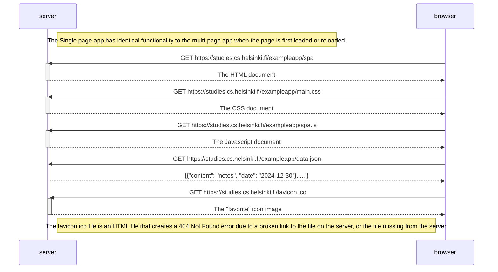

# Part 0 Exercise 0.5: Single Page App Diagram

```mermaid
sequenceDiagram
    participant server
    participant browser

    Note right of server: The Single page app has identical functionality to the multi-page app when the page is first loaded or reloaded. 

    browser->>server: GET https://studies.cs.helsinki.fi/exampleapp/spa
    activate server
    server-->>browser: The HTML document
    deactivate server

    browser->>server: GET https://studies.cs.helsinki.fi/exampleapp/main.css
    activate server
    server-->>browser: The CSS document
    deactivate server


    browser->>server: GET https://studies.cs.helsinki.fi/exampleapp/spa.js
    activate server
    server-->>browser: The Javascript document
    deactivate server
    
    browser->>server: GET https://studies.cs.helsinki.fi/exampleapp/data.json
    activate server
    server-->>browser: {{"content": "notes", "date": "2024-12-30"}, ... }

    browser->>server: GET https://studies.cs.helsinki.fi/favicon.ico
    activate server
    server-->>browser: The "favorite" icon image
    deactivate server

    Note left of browser: The favicon.ico file is an HTML file that creates a 404 Not Found error due to a broken link to the file on the server, or the file missing from the server.


```